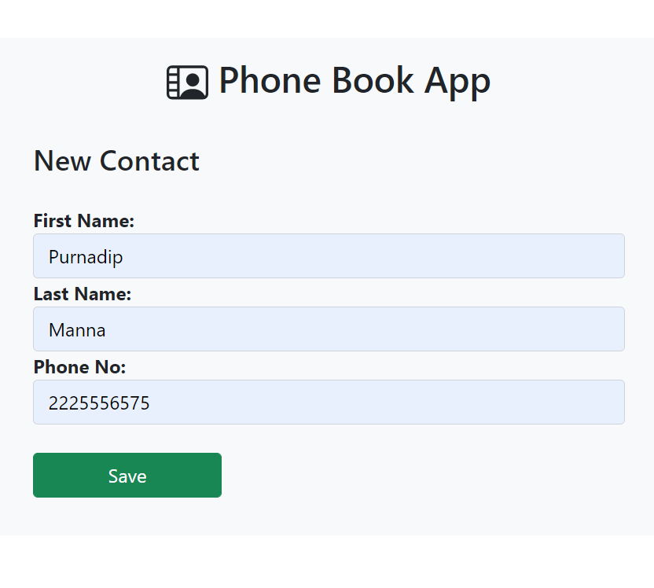

# Phone_Book_App
This is a simple phone book application with CRUD operations made in Django for an Internship Assessment.

App Link : https://phone-book-app-purnadip-manna.herokuapp.com/

## Home Page:

## New Contact:
Clicking `+ Add Contact` button we can add new contact.

## Update Contact:
Clicking the edit button *(yellow)* we can update an existing contact.

## Delete Contact:
Clicking the delete button *(red)* we can delete contacts.

